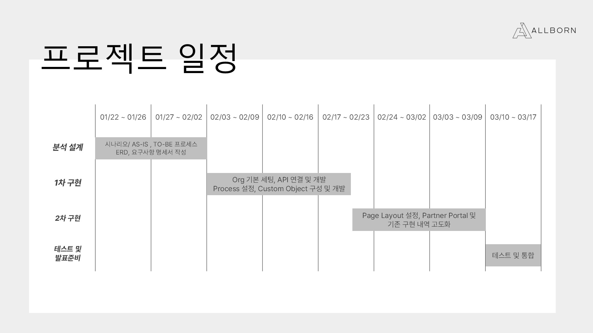
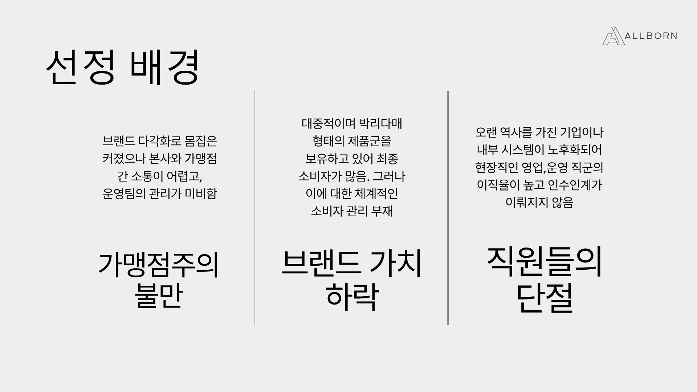
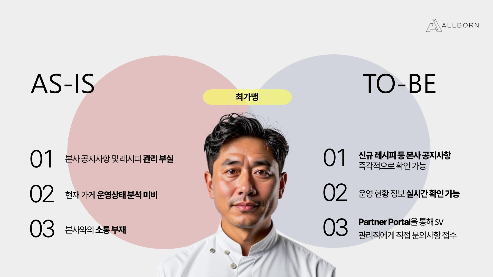
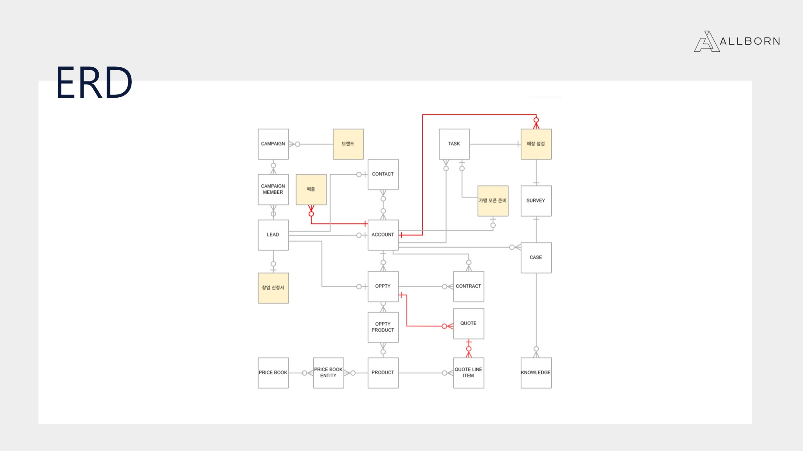
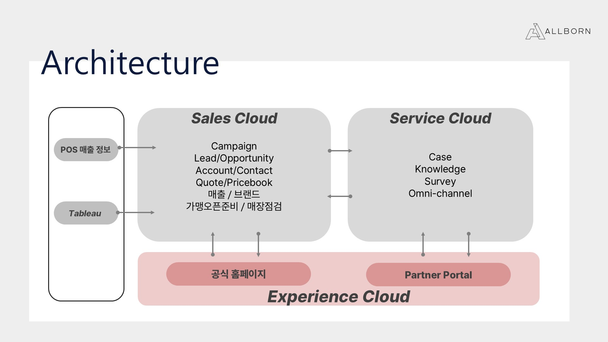
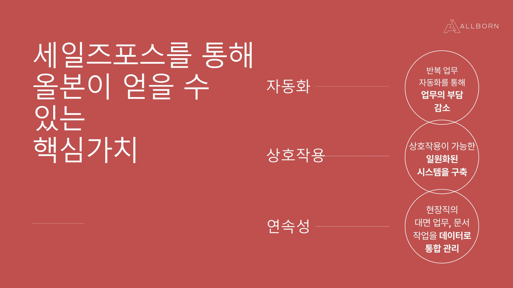

### 한줄 요약: 정보 공유와 자동화를 통해 내부 직원의 업무 생산성을 향상 시켜, 가맹점을 보다 체계적으로 관리해, 최종 소비자의 선택을 이끌어 신규 가맹 유인 및 기존 가맹 재계약에 용이하게!

##  1. 프로젝트 개요  

###  1-1. 팀원 소개  

| 역할 | 이름 |  
|---|---|  
| **PM / ADMIN / DEV** | 박우빈(본인) |  
| **PL / DEV** | 이담비 |  
| **ADMIN** | 임현아 |  
| **ADMIN** | 전석조 |  
| **ADMIN** | 전석조 |  

###  1-2. 프로젝트 일정 
- 

---

### 1-4. 가상의 기업  
- **기업명:** 올본
- **업종:** 외식 프랜차이즈업
- **레퍼런스 기업명:** 더본
- **주요 PAIN POINT:**  
  -   
- 가맹점주의 이탈... 하지만 세부적으로 본다면:
> - 가맹점에 대한 정보를 직원 간 미공유으로 관리의 질 하락
> - 비체계적인 내부 시스템으로 인해 업무가 비효율적이고 과다함
> - 가맹점 관리 미흡으로 인한 매출 하락
> - 악순환이 본사에 대한 불신이 되어 가맹 재계약 불발 및 신규 유입 저하.
---

### 1-4. 주요 대상  

#### 1-4-1. **외부 고객**  
- **엔드유저(일반 소비자)**:  
  - 가맹점 관리 비표준화로 인한 맛과 서비스 불만 → 가맹점 이용률 하락  
  - 해당 유저는 결국 내부 고객의 PAIN-POINT를 해결하면 자연스레 증가할 것으로 예상하여, 가맹점주와 통합하여 관리  

#### 1-4-2. **내부 고객**  
| 역할 | 이미지 |  
|---|---|  
| **가맹점주** |  |  
| **영업 담당자** |  |  
| **CS 담당자** |  |  
| **슈퍼바이저** |  |  

---

## 1-5. 시스템 구조  

### 1-5-1. ERD  
-   
- 빨간 선은 Master-Detail 관계

### 1-5-2. 사용 기술 및 도구  
- **CRM:** Salesforce  
    
- **버전 관리:** GitHub  
- **협업 툴:** 노션, 지라, 미로, 뷰티풀AI  

---

## 2. 개인 기여 내용  

### 2-1. 프로젝트 전반적 기획
   **주제선정**
  - 주제 선정을 위해 각자에게 간소화된 Customer Journey 양식을 제작 및 배포하고 이에 맞게 그려오게 지시
    
   **SCOPE 정의**
  - 어떤 부서에서 사용할지 결정
    
   **세일즈포스에서의 구현 타당성 검토**
  - 구현하려는 것이 Needs인지 Wants인지 검토
  - Wants라면 공수에 비해 Return이 확실한지 검토
  -  외부적인 요소(ex:카카오톡)으로 충분히 가능한데 굳이 구현해야 하는지 검토
  -  Standard Object으로도 충분한지 검토

  **Object 관계 관리**
  - Master-Detail이 적합한지, look-up이 적합한지 판단
  - 5개의 Custom Object 중, 4개의 Custom Object 직접 생성 및 필드 작성
    
  **개발과 비개발의 분장**
 - Flow와 Configure로 구현이 가능한지 판단 및 분장
   
  **일정과 과업 조율**
  - 현재 어떤 과업을 진행하고 있으며, 기한 내에 끝낼 수 있는지 확인
  - 없다면 해당 이유와 과업 재분배
    
  **최종 검토**
   - 기존 정의했던 요구 사항과 일치한지 확인
   - 우리가 처음에 목표했던 기능이 구현되었는지 검토

     ---
     
### 2-2. 시스템 설정 및 Configure  
>- **ROLE HIERARCHY** 정립 및 이에 맞게 **PROFILE 권한 차등 부여** (최소 권한 원칙 적용)  
>- 모든 **Custom Object 생성 및 기본 OBJECT와의 관계 설정**  
>- 모든 **APP에 대한 PAGE LAYOUT 설정**   
>- 전체 **프로세스 정립 및 객체별 RECORD TYPE 정의**  
>- **타당성 검토 및 충돌 방지를 위한 전체 FLOW 검수**  

### 2-3. 개인 구현 내용  

**2-3-1. 슈퍼바이저 AS-IS → TO-BE 개선**

>  📌 **업무 360 뷰 개발**
> > - **구현 배경:**
  >>> 1. 기존 AS-IS에선 반복적 업무의 배정 창구도 **파편화** 되어있으며, 이에 따라 업무 우선 순위 책정이 어려움
  >>> 2. 업무 우선 **순위 책정**도 어려우며, 스케줄링 또한 **개인적**으로 설정해야함
  >>> 3. 이에 따라 해당 솔루션을 통해 자동적으로 배정된 업무 중, **시급성**을 요하는 업무만 따로 정리.
> >  >   
> > - **사용 기술:**
> > >
>>> JS, LWC, HTML, APEX
> > >
  >> - **시연 영상:**
> > >
  >>> 
> > >
>> - **특이사항:**
> >> 
>>> 1. 현재 시나리오에선 이 3가지 업무 VIEW LWC만 필요했지만, **사업이 확장되고 추가적인 시나리오에서 해당 VIEW의 필요 가능성**
>>> 2. 따라서 **부모-자식 LWC**로 설계
>>> 3. **자식 LWC**는 **동일**하게, **부모 LWC**는 첨부된 **부모 템플릿 JS, APEX, HTML**을 **예시 파일**을 참조하여 작성함으로 **동일하게 작동하는 VIEW 제공 가능**

> 📌 **모바일 앱 통한 점검 SCREEN FLOW**
  >> - **구현 배경**
>  >> 1. 기존 AS-IS에서 가맹점에 대해 **현장 점검**을 진행할 때 **비효율** 발생
  >>>> - 비효율의 예시: 
  >>>> - **수기**로 작성한 내용과 찍은 상세 사진을 엑셀에 **취합**
  >>>> - 점검을 위한 **노트 및 노트북** 상시 휴대 필요
  >>>> - 추후 취합시 해당 점검 내용이 어느 매장에 대한 것인지 **재확인** 필요
  >>> 2. 점검시 일정 **가이드라인**의 **부재**로 슈퍼바이저의 **경험**에 따라 점검의 퀄리티가 **천차만별**
  >>> 3. 이에 따라, **모바일 환경**에서 **점검을 진행**하게 하며 이를 **레코드로 저장**해 **가맹점 레코드와 연결**.
  >>> 4. 동시에 **가이드**를 **마련**해 **일정 수준의 퀄리티 보장**
>  >>   
>  > - **사용 기술:**
>  >   > FLOW, CONFIGURE
>  > >  
  >> - **시연 영상(소리 주의)**
>  >   >
  >> > 
>  > > 

>📌 **UI & UX 향상 및 필드 수정 제한**
>> -**구현 배경**
  >>> 1. 슈퍼바이저의 업무 중 **정기 점검의 결과**는 대상 **가맹점을 평가**하는 요소 중 하나로, 그 중요도가 상당함
  >>> 2. 동시에 정기 점검의 **날짜를 확정함에** 있어 **기존의 필드 수정은 수정-수정항목 입력-저장 버튼을 입력**해야 하고, **대상 가맹점주의 연락처와 이름**을 한번에 **볼 수 없음**
>  >> 3. 따라서 **해당 레코드의 필드의 수정**을 TRIGGER를 통해 제한하고, 필요한 필드의 수정의 UX측면 향상과, 추후 결과를 한 눈에 보기 위해 **SCREEN FLOW** 도입
  >>>
>>  - **사용 기술**
>>  - 
>>    > Flow, Apex Trigger
>>    > 
>>  -**시연 영상**
>> >
  >>> 
>>   >
>> -**특이사항**
>> > 1. VALIDATION RULE로도 필드 수정을 제한할 수 있지만 모든 점검 항목이 필드임
>> > 2. 따라서 VALIDATION RULE로 이를 모두 제한하기엔 불가해 TRIGGER를 통해 제한

>📌 **재계약 기회 생성 자동화**
>> -**구현 배경**
  >>> 1. 외식 프랜차이즈 사업에선 신규 유입만큼 **기존 계약을 갱신**하는 것도 중요함
  >>> 2. **재계약을 미리 알게** 하여 더욱 관리를 잘하게끔 **재계약 기회 생성 자동화**
  >>> 3. 먼저 **모든 CONTRACT 레코드**를 **확인**해 **계약 만료일이 6개월 이내**고, **기회가 미생성 되었다면 기회 생성**
  >>> 4. **효율적인 재계약**을 위해, **재계약 기회의 OWNER**는 **영업담당자**로 전환. **슈퍼바이저**는 **기회 팀에 추가**
>>>
>> -**사용 기술**
>> >
>> >Flow, Apex
>> >
  >> - **시연 영상**
  >>>  
>>  >   

  >> - **특이사항**
>  >> 1. 현재 프로젝트에선 CONTRACT 레코드의 수가 많지 않아 **SCHEDULE FLOW**로도 구현이 가능함
>  >> 2. 그러나 **추후 사업이 확장**된다면, 한번에 확인해야 하는 **CONTRACT 레코드의 수가 많아짐**에 따라 **GOVERNOR LIMIT** 위험 상승
>  >> 3. 따라서 이를 **APEX SCHEDULE BATCH**로 구현.

**2-3-2. 가맹점주 파트너 포탈 OMNI-CHANNEL 및 CS 담당자 변경 구현**
> - **구현 배경**
> > 1. B2B CASE의 **신속한 접수 및 처리**가 기존엔 **불가**
>> 2. 이를 해결하기 위해 **OMNI-CHANNEL** 구현
>> 3. **전역 WEB-TO-CASE 작업**을 생성해, **CASE-ORIGIN을 파트너 포털**로 설정
>> 4. 해당 **전역 작업**을 통해 사전 정의된 **파트너 큐에 라우팅**
>> 5. 이와 별개로, **슈퍼바이저에 대한 불만 사항 처리**를 위해 **CASE-ORIGIN을 올본 신문고**로 설정한 **전역 WEB-TO-CASE 작업** 생성
>> 6. **올본신문고**를 통해 들어온 **CASE는 슈퍼바이저의 팀장이 OWNER**가 됨.
> >   
> - **시연 영상**
>>
>>  

**2-3-2. 이외 다수**
- **Process: 신규 가맹 계약**
  > 1. 신규가맹점 OPPTY에서 **STAGE 진행**시 평수 필드가 미입력이고 다음 STAGE로 넘어갈 때 **해당 필드 팝업 LWC 개발**
  > 2. 신규가맹점 OPPTY에서 **평수** 필드가 **출점제한** STAGE라면 Page Layout 최상단에 나오게 **Screen Flow 구현**
- **Process: 가맹준비**
  > 1. **CONTRACT** 객체 레코드가 ACTIVATED 될 시 **가맹준비 객체 레코드 생성 FLOW 구현**
  > 2. 가맹준비 객체의 각 **PATH의 예상 완료일이 지난** 후에도 다음 단계로 **미진행시 NOTIFICATION 발송 FLOW 구현**
  > 3. 가맹준비 객체의 **STAGE가 '정상오픈'일시** 자동으로 **TASK 생성 및 TASK의 매장점검 객체 레코드화 FLOW 구현**
- **Process: 매장 정기 점검**
  > 1. 매장점검이 끝나면 **SURVEY 발송** 및 해당 **SURVEY INVITATION을 ACCOUNT와 매장점검 레코드에 연결 FLOW 구현**
  > 2. 매장점검이 끝나면 다음 **점검예상일**이 **계약 기간 내**라면 **자동 정기 점검 생성 FLOW 구현**
  > 3.  **SURVEY INVITATION 객체**와 **매장 점검 객체**를 연결하기 위한 **FLOW 구현** 및 **REPORT TYPE 생성**
- **Process: 가맹 관리**
  > 1. **B2C CASE 발생**시 CS 담당자 판단 하에 **ACCOUNT(가맹점)의 담당 슈퍼바이저**가 **CASE OWNER**가 되게 하는 **ACTION(FLOW) 구현**
  > 2. 슈퍼바이저가 CASE OWNER 될 시, **매장점검의 긴급점검 RECORD TYPE 레코드 생성 FLOW 구현**
- **Process: 고객 360**
  > 1. ACCOUNT(가맹점)에 대해 **고객360**을 제공하기 위해, **TIME WARP 도입 및 시나리오에 맞게 수정**
  > 2. 객체 중 **ACCOUNT PAGE LAYOUT**에 **필요**한데 없는 경우 필요성에 따라 **LOOK-UP 혹은 MASTER-DETAIL** 관계 설정
- **Process: 기타**
  > 1. **KPI**에 직결되는 **대시보드 생성** 및 이를 위한 **REPORT 작성**
---

## 3. 기대 효과  
   
 
✅ 가맹점 운영의 표준화로 **고객 만족도 향상**  및 **매출 증대**

✅  CRM 시스템 구축을 통한 **가맹점과 본사, 그리고 내부 직원 사이의 원활한 상호작용**  

✅ **업무 프로세스 자동화**를 통한 운영 효율성 증대  

✅ **잦은 이직과 퇴사**에도 데이터 공유를 통한 **업무 연속성** 존재.

---

## 4. 추후 보완점
1.	현재 캠페인을 창업설명회로만 사용 중인데 이를 **시즌별 프로모션 메뉴** 등 다른 마켓팅적 캠페인으로 확장하여, 해당 내용을 **대시보드화** 하여 추후 **제품 개발**에 참조
2.	**AGENT FORCE** 도입으로 CASE OWNER가 변경될 시 기존 CASE 내역을 **AI SUMMARY FIELD GENERATE**로 쉽게 파악 
3.	DATA CLOUD 도입으로 기존 CRM에 저장된 정형 데이터만 관리하는 것을 벗어나, 배달앱, 광고 클릭, 소셜 미디어 데이터까지 실시간 통합하고 활용. 이를 통해:
-	**가맹점별 매출 변동 패턴 분석**: POS,배달앱 매출 데이터를 연계해 **이상 징후(매출 급감, 고객 수 감소) 실시간 감지** 및 조기 대응
-	**슈퍼바이저 지원**: 매장 방문 시 모바일 위치 데이터 및 AI 기반 이미지, 음성 분석을 활용하여 **자동 점검 보고서 생성**
-	**데이터 기반 의사결정 최적화**: 날씨, 지역 행사, 경쟁 브랜드 광고 등을 고려한 **AI 예측 분석을 활용하여 운영 전략 수립**
4.	최종 소비자에게 맴버십 제공이 된다면 **Marketing Cloud 연계**를 통해 실시간 고객 행동 데이터를 반영한 **초개인화 마케팅 강화**
-	고객이 배달앱에서 특정 브랜드를 검색하거나 주문하면 **즉시 맞춤형 쿠폰 및 프로모션 발송**
-	웹사이트 방문, 앱 사용, 구매 패턴을 분석하여 **자동화된 캠페인 실행 및 타겟팅 강화**
-	가맹점별 고객 데이터를 활용한 **브랜드 충성도 프로그램 고도화**

## 📎 작성자 정보

- **이름: 박우빈**
- **메일: woobin08@gmail.com**

---
