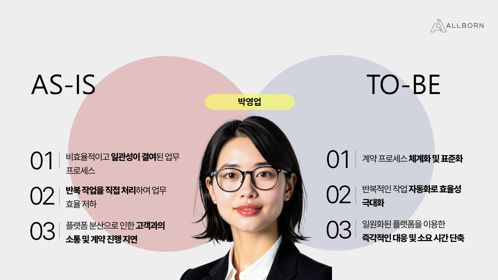
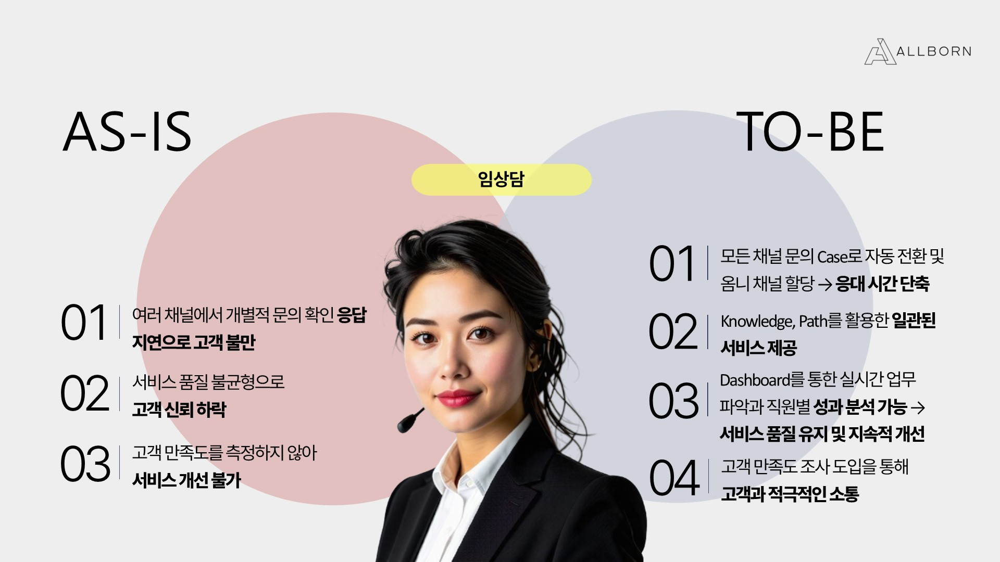

# 🏆 세일즈포스 청년 CRM101 3기 프로젝트 - Team 4  
---
안녕하세요 박우빈입니다. 제 포트폴리오에 방문해주셔서 감사합니다.
---

## 📌 프로젝트 개요  

## 👥 팀원 소개  

| 역할 | 이름 |  
|---|---|  
| **PM / ADMIN / DEV** | 박우빈 |  
| **PL / DEV** | 이담비 |  
| **ADMIN** | 임현아 |  
| **ADMIN** | 전석조 |  
| **ADMIN** | 전석조 |  

### 📍 레퍼런스 기업  
- **기업명:** 더본  
- **업종:** **외식 프랜차이즈업**  
- **선정 배경:**  
  - 더본의 주가 하락 원인은 오너 리스크뿐만 아니라 가맹점주와의 소통 부재도 주요한 요인으로 작용함.  

### 📍 가상의 기업  
- **기업명:** 올본  
- **주요 PAIN POINT:**  
    

---

## ⚙️ 시스템 개요  

### 🎯 주요 대상  

#### **외부 고객**  
- **엔드유저(일반 소비자)**:  
  - 가맹점 관리 비표준화로 인한 맛과 서비스 불만 → 가맹점 이용률 하락  
  - 해당 유저는 SCOPE에서 제외하고, 가맹점주와 통합하여 관리  

#### **내부 고객**  
| 역할 | 이미지 |  
|---|---|  
| **가맹점주** |  |  
| **영업 담당자** |  |  
| **CS 담당자** |  |  
| **슈퍼바이저** |  |  

---

## 🏗️ 시스템 구조  

### 📌 ERD  
  

### 📌 사용 기술 및 도구  
- **CRM:** Salesforce  
    
- **버전 관리:** GitHub  
- **협업 툴:** 노션, 지라, 미로, 뷰티풀AI  

---

## 📌 개인 기여 내용  

### ⚙️ 시스템 설정 및 Configure  
- **Role Hierarchy** 정립 및 이에 맞게 **Profile 권한 차등 부여** (최소 권한 원칙 적용)  
- 모든 **Custom Object 생성 및 기본 Object 관계 설정**  
- 모든 **APP에 대한 PAGE LAYOUT 설정**  
- 전체 **프로세스 정립 및 객체별 Record Type 정의**  
- **타당성 검토 및 충돌 방지를 위한 전체 Flow 검수**  

### 🏗️ 개인 구현 내용  
- UI & UX 개선을 위한 모든 **Screen Flow 구현**  
- **슈퍼바이저 AS-IS → TO-BE 개선**  
- **가맹점주 파트너 포탈 기능 구현**  
- **가맹점주 관련 OMNI-CHANNEL 기능 개발**  

---

## 🚀 기대 효과  

✅ 가맹점 운영의 표준화로 **고객 만족도 향상**  
✅ 효율적인 **CRM 시스템 구축을 통한 가맹점과 본사 간 원활한 소통**  
✅ **업무 프로세스 자동화**를 통한 운영 효율성 증대  

---

## 📎 기타  

- **프로젝트 발표 자료:** [링크 삽입]  
- **관련 문서 및 추가 자료:** [링크 삽입]  

---
